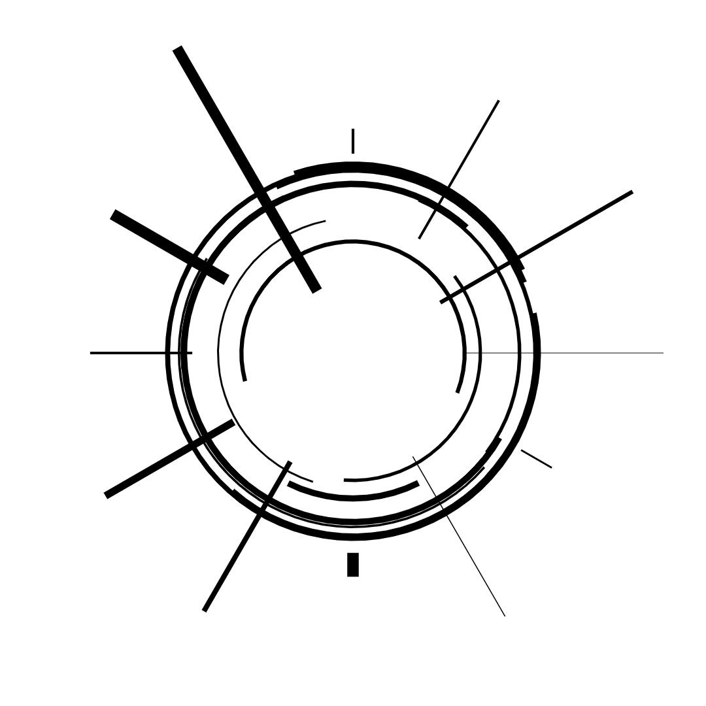
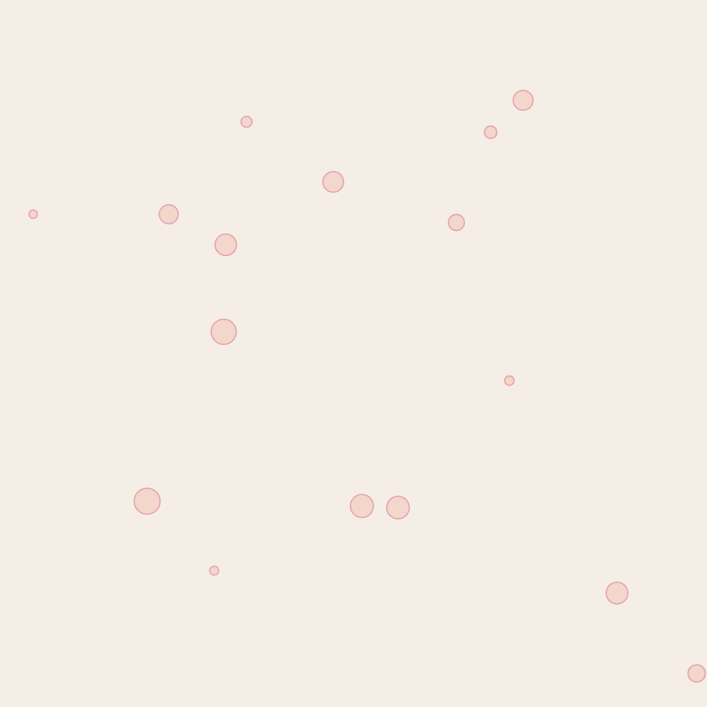

# creative-coding/

In terminal to open an existing project# Creative Coding Repository

This repository contains various creative coding projects.

## Getting Started

To open an existing project, navigate to the terminal and run the following command:

\`\`\`bash
npx canvas-sketch sketches/sketch-02.js
\`\`\`

This will open the project located at `sketches/sketch-02.js`.

## Project Structure

The main projects are located in the `sketches` directory. Each sketch is a separate project.
## Project Images

Here are some images from the projects:

## Requirements

These projects require [Node.js](https://nodejs.org/) and [canvas-sketch](https://www.npmjs.com/package/canvas-sketch) to be installed.

## Installation

To install the necessary dependencies, run the following command in your terminal:

\`\`\`bash
npm install
\`\`\`

## Contributing

Contributions are welcome! Please read the [contributing guide](CONTRIBUTING.md) for more information.

## License

This project is licensed under the MIT License - see the [LICENSE](LICENSE) file for details.
npx canvas-sketch sketches/sketch-02.js           